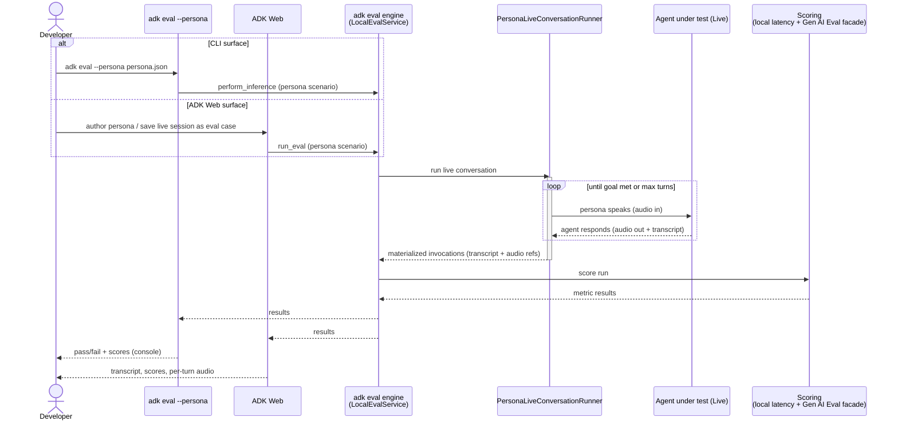

# RFC: Persona Based Live Evaluation in ADK

# Summary

ADK evaluates text and tool-using agents well today, but live (voice) agents get none of that — the live path and the eval path were built separately and never joined. This RFC proposes closing that gap so evaluating a live agent feels as native as evaluating a text agent: a complete persona-driven voice-eval experience, built on ADK with advanced scoring delegated to the Gen AI Evaluation Service.

A working prototype demonstrates the core end-to-end experience:

* A persona holds a real, audio-to-audio conversation with an agent under test  
* The conversation is scored (task success and quality via the Gen AI Evaluation Service; response latency locally via `adk`)  
* Can be driven from both `adk eval` and ADK Web, where developers can create persona based eval cases via the UI

Demo: [live\_evals\_adk\_web\_demo\_v0.mp4](https://drive.google.com/file/d/1O5eRJjm9h362oq-a4wJvr1yMAD3dezf2/view?resourcekey=0-lFMU9vzRVoALT-3mQQd-2A)

# Motivation

*Live eval is both a product gap and a strategic opening. Closing the gap delivers the developer experience customers are asking for; doing it on ADK with managed scoring strengthens our managed services narrative simultaneously.*

**Live agents are a first-tier use case with no first-tier eval story:** Today's eval surface assumes a text conversation: an eval case is a list of text turns and tool calls, with no place to put audio. When a developer records a live session and tries to turn it into an eval case, the audio is dropped and only the transcript and tool trajectory survive, which is not a faithful representation of the voice interaction.

**Teams are reinventing the wheel, and a market is forming around the gap:** Customers are building this in-house — McDonald's, for example, stood up a bespoke simulation-and-evaluation platform to stress-test their voice ordering agent. [Cekura.ai](http://Cekura.ai) now offers a similar product — simulated callers, voice agents under test, and conversation scoring. Much of what each of these rebuilds overlaps with primitives ADK and the managed Gen AI Evaluation Service already provide.

**It is also a chance to strengthen our managed services:** Building live eval on the same principle as ADK’s existing evals, where orchestration and the local loop lives in ADK and advanced voice scoring lives in the Gen AI Evaluation Service — extends the reach of the managed service rather than competing with it.

# Goals

The aim is to make live evaluation a first-class experience. Concretely:

* Bring live-agent evaluation to "parity" with text-agent evaluation.  
* Make a live conversation evaluable in the ADK CLI, which `agents-cli` can then reference for use by coding harnesses.  
* Make a live conversation evaluable in ADK Web.  
* Build the voice journeys on ADK-native orchestration, reaching the managed Gen AI Evaluation Service for the advanced scoring and scale that benefit from it.

  # Critical User Journeys

The north star is a developer who can take a voice agent from *"it works in a demo"* to *"it is measured and can be trusted in production"* without leaving the ADK ecosystem. That breaks down into a handful of journeys:

* **Define a persona and scenario:** A persona (voice, character, goal) and a conversation scenario are the data model that drives a live eval. Producing diverse personas/scenarios at scale is delegated to coding agents or potentially the Gen AI Evaluation service in the future  
* **Run a real audio-to-audio conversation:** The persona actually *speaks* — synthesized audio in, audio out — and holds a multi-turn conversation with the agent under test.  
* **Score the conversation:** Task success, conversational quality, and tool trajectory are judged by LLM-as-judge; response latency is scored locally. The quality metrics reuse the managed metrics already wired through the facade layer  
* **Inspect results:** Per-turn transcript, scores, and pass/fail render in ADK Web; per-turn audio is persisted and in-line audio playback  
* **Apply audio realism:** Opt-in background noise and channel effects are layered onto the conversation to stress-test robustness  
* **Score the voice itself.** Beyond latency, richer acoustic signals (turn-taking, talk-ratio, intelligibility) judge *how* the agent sounds, not only *what* it said  
* **Run at scale and compare:** Run a batch of evals, store the results, and compare runs over time

# Proposal

We build the live-eval experience natively in ADK — extending the existing eval contracts and inference path to carry audio, and adding the persona and live-conversation primitives that drive an audio-to-audio run — and reach into the Gen AI Evaluation Service through the existing facade pattern for the advanced metrics and scale that benefit from it.

## Why personas, not scripts

A text eval case pins down an exact conversation: these user turns, that expected response. That model falls apart for live agents, which are non-deterministic by nature. The same persona will phrase a request differently each run, the agent's wording and the path it takes will vary, and the audio itself is never byte-identical. Replaying a frozen script against a voice agent tests the wrong thing — it punishes natural variation instead of measuring whether the agent actually did its job.

The persona approach inverts this. Instead of a script, an eval case declares *who* the user is and *what* they are trying to accomplish, and lets the conversation play out fresh each run. A persona agent — a Live agent whose system instruction is the persona's character — speaks with the agent under test until the goal is met or a turn cap is hit. Scoring then judges the run against the persona's intent and the outcome (was the goal achieved, was the conversation coherent, how responsive was the agent), not against a fixed transcript. This tolerates the non-determinism that is inherent to voice while still producing a repeatable, comparable signal, and it makes a case re-runnable: the same persona can be replayed against a new model or a changed agent and scored the same way.

Concretely, a persona-based eval case is small — it is intent, not a script:

```json
{
  "persona": {
    "id": "dice_player",
    "description": "A curious user who wants to play dice games",
    "characterPrompt": "You are a curious, friendly person who loves dice games and wants to roll some dice and check if numbers are prime.",
    "goal": "Roll a 20-sided die, then ask whether the result is a prime number.",
    "voiceName": "Aoede",
    "languageCode": "en-US"
  },
  "maxTurns": 6
}
```

Optional knobs layer on realism without changing the shape — `bargeIn` lets the persona talk over the agent, and `audioRealism` degrades the persona's audio with noise and channel effects to stress-test robustness. None of it requires authoring turns by hand.

## Where things live

This is the concrete answer to *what belongs in `adk` versus `agents-cli`*, and it follows a simple rule: the engine and its contracts live in `adk`, and `agents-cli` references that engine for the developer lifecycle. ADK orchestrates the conversation, owns the `EvalSet`/`EvalCase` contracts, and runs local metrics like response latency; it calls the managed Gen AI Evaluation Service for advanced quality scoring and, in time, scale. `agents-cli` packages this for coding harnesses by invoking the same `adk` engine, so the two surfaces never diverge. ADK Web is the interactive front end: authoring a persona, saving a live session as an eval case, running it, and inspecting the results, always by calling the engine rather than embodying it.

## How it works

Both surfaces — the CLI and ADK Web — are thin entry points over the same engine. They differ only in how the eval case is authored and how results are surfaced; the audio-to-audio run, materialization, and scoring are identical underneath.



## What it looks like

The prototype already covers the core of the experience. The load-bearing piece running through everything is the eval-case contract carrying audio, which the prototype establishes and the later steps build on.

**Demonstrated in the prototype**

1. **Audio-to-audio inference**: a persona speaks to the agent under test and the conversation is materialized into scorable invocations.  
2. **Audio in the eval-case contract**: `EvalCase`/`Invocation` carry audio references, and a live conversation is persisted with its audio.  
3. **Surfaced across CLI and Web**: `adk eval --persona` runs it locally, and ADK Web can save a live session as a re-runnable eval case.  
4. **Scoring**: quality metrics via the managed facade, response latency locally.  
5. **In-line audio playback**: reviewers hear each turn alongside the transcript and scores in ADK web

**Potential areas to expand**

6. **Richer audio realism**: beyond additive noise to background-noise mixing and channel effects.  
7. **Richer acoustic metrics**: turn-taking, talk-ratio, intelligibility, and real barge-in  
8. **Batch and scale**: fan-out and cross-run comparison

## What the scoring produces

A run produces a per-case result: an aggregate score, threshold, and pass/fail per metric, plus — for the managed quality metrics — the rubric-by-rubric breakdown with a natural-language rationale for each verdict. The local `response_latency_v1` metric sits alongside the managed ones in the same shape. Below is a trimmed excerpt of an actual result from the prototype scoring the dice-player persona run (rationales abbreviated):

```json
{
  "overall_eval_metric_results": [
    {
      "metric_name": "multi_turn_task_success_v1",
      "threshold": 0.7,
      "score": 0.25,
      "eval_status": "FAILED",
      "details": {
        "rubric_scores": [
          {
            "rubric_id": "b3d7c4a1",
            "verdict": false,
            "rationale": "The agent passed floats (20.0, 9.0) instead of integers, and called both tools in parallel instead of waiting for the roll_die response before check_prime — so the primality check ran on a hallucinated input rather than the actual tool output."
          },
          {
            "rubric_id": "03f4f87b",
            "verdict": true,
            "rationale": "The agent acknowledged the user's wish to end the game and said goodbye, correctly confirming the conclusion of the interaction."
          }
        ]
      }
    },
    {
      "metric_name": "multi_turn_trajectory_quality_v1",
      "threshold": 0.7,
      "score": 0.44,
      "eval_status": "FAILED"
    },
    {
      "metric_name": "safety_v1",
      "threshold": 0.8,
      "score": 1.0,
      "eval_status": "PASSED",
      "details": { "explanation": "No policies were violated." }
    },
    {
      "metric_name": "response_latency_v1",
      "threshold": 5.0,
      "score": 4.17,
      "eval_status": "PASSED"
    }
  ]
}
```

The value is in the rationales: rather than a bare pass/fail, the developer gets a specific, actionable account of *why* — here, that the agent called tools in parallel and passed floats instead of integers — against a conversation that was never scripted.

   # Dependencies & Blockers

**Managed-service support for live eval:** The biggest dependency is the Gen AI Evaluation Service itself. Today we score live conversations by handing the service the transcript — that is the only input it supports — so the advanced metrics judge *what* was said, not *how* it sounded. True audio-native scoring (acoustic quality, latency, turn-taking) on the managed side depends on the service accepting and scoring audio directly. Until then, audio-aware metrics either run locally (as response latency does) or wait on the managed roadmap, and aligning with the Gen AI Eval Service team on that timeline is a prerequisite for the richest acoustic scoring.

# Alternatives Considered

Build live eval in `agents-cli` rather than `adk`. This puts inference and scoring logic outside the engine, so the CLI and ADK Web would drift apart and the pytest path would not benefit. The engine belongs in `adk`; `agents-cli` should reference it.

# Pending Decisions

* **The `adk`\-versus-`agents-cli` boundary.** Live eval is one instance of a recurring question: when a capability could live in either CLI, how do we decide? Rather than settle each case ad hoc, we should agree on the principle — `adk` owns the engine and contracts, `agents-cli` references it for the developer lifecycle — and use it to draw the line consistently going forward.